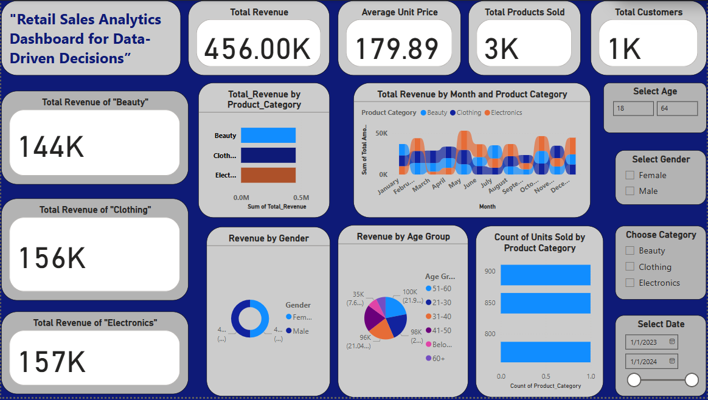
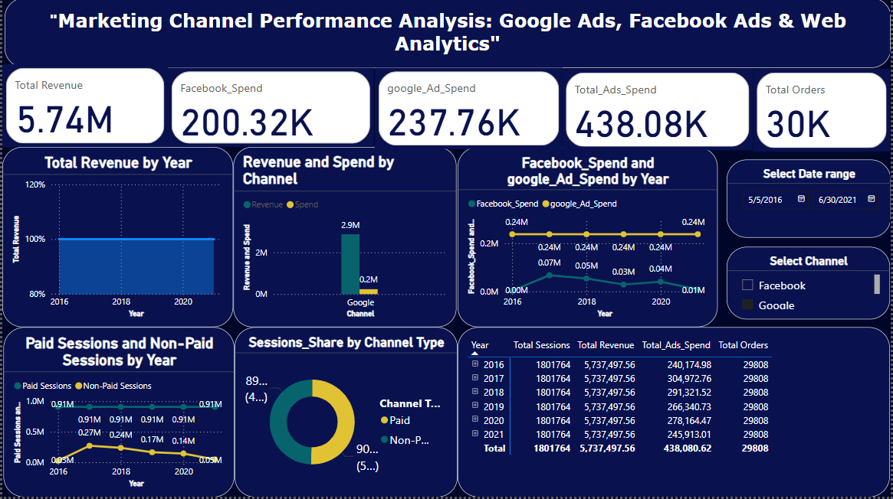
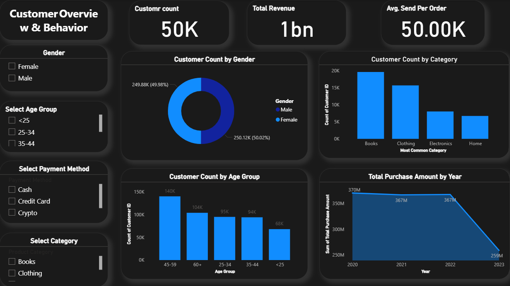
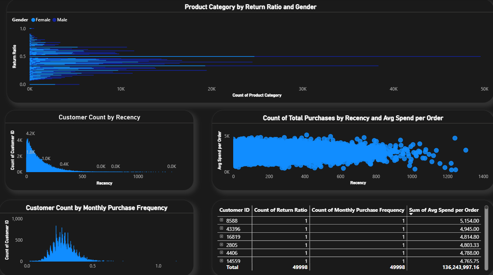
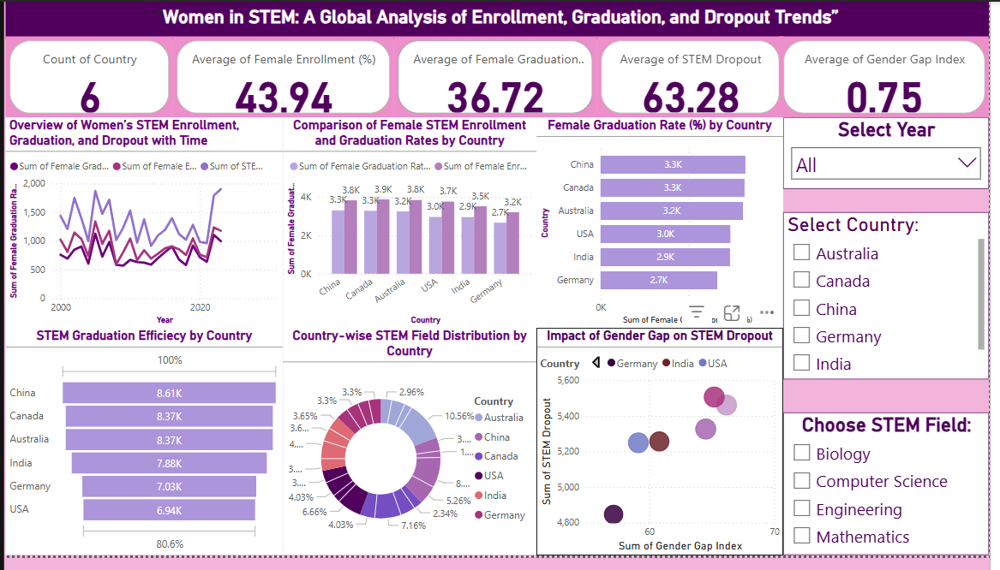
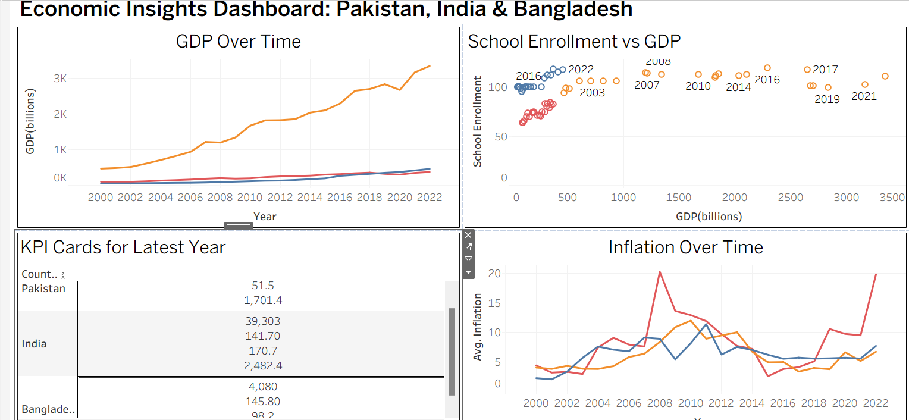
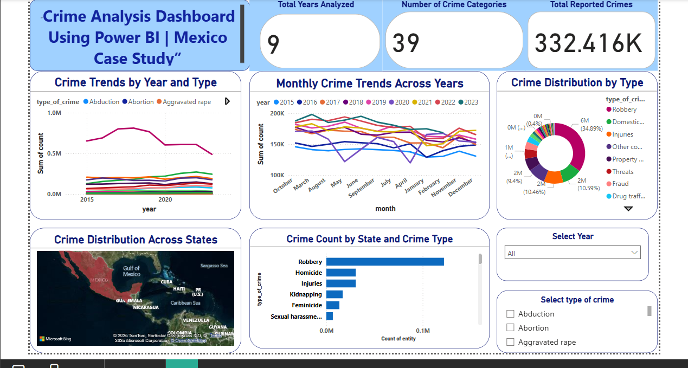
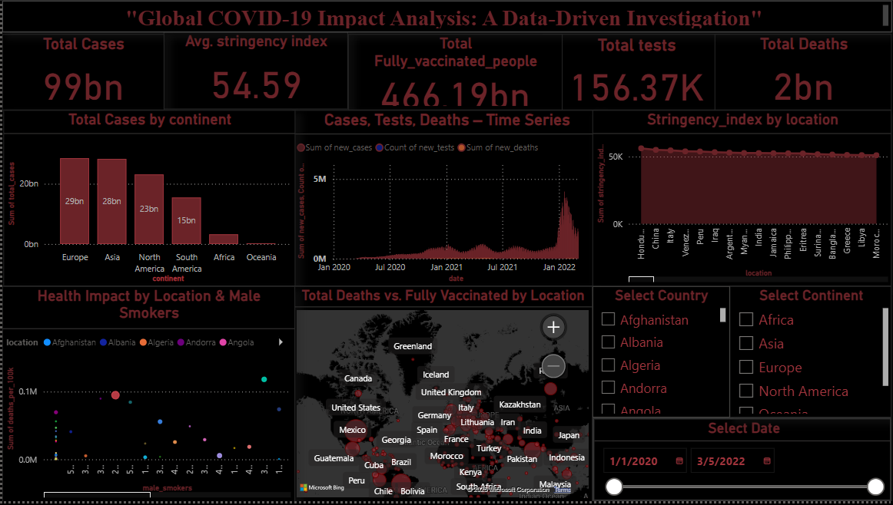
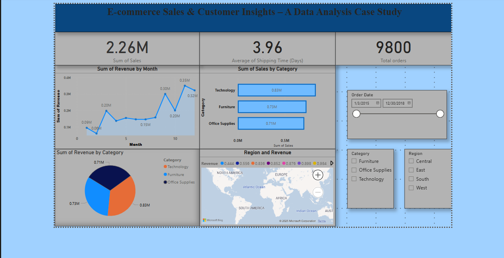

# Sandleen Sethi – Data Analyst Portfolio

Welcome to my data analytics portfolio! I am a self-taught data analyst skilled in SQL, Python, Power BI and Excel. This portfolio showcases real-world projects where I have transformed raw data into meaningful insights through dashboards, reports, and visual storytelling.

---

## Projects

---
## 1. HR Analytics & Attrition Prediction (Capstone Project)

**Tools**: Python (Pandas, NumPy, Scikit-Learn, Matplotlib, Seaborn)  

**Description**:  
- Explored HR dataset (15,000 employees) to identify drivers of employee attrition.  
- Conducted EDA: attrition strongly linked to **overwork**, **low satisfaction**, and **4-year tenure dips**.  
- Built predictive models: **Random Forest achieved 96% accuracy and 0.94 AUC**.  
- Delivered actionable recommendations for HR: cap project load, address burnout, and refine promotion/evaluation policies.
- 
###  Exploratory Data Analysis (EDA)

**Correlation Heatmap**  
Shows strong negative correlation between satisfaction and attrition, and positive correlations between project load, hours, and evaluations.  

**Attrition Distribution**  
Compares employees who left vs. stayed across key groups.  

---

### 🤖 Modeling & Results

**Logistic Regression – Confusion Matrix**  
Baseline model achieved ~82% accuracy.  
.png)

**Decision Tree – Splits**  
Visualizing the splits shows project load and evaluation as key factors.  

**Random Forest – Confusion Matrix**  
Best-performing model with 96% accuracy and 0.94 AUC.  

---

###  Feature Importances

**Decision Tree Feature Importance**  
Highlights last evaluation, number of projects, and tenure as top predictors.  

**Random Forest Feature Importance**  
Consistently identifies evaluation, projects, and overwork as strongest drivers of attrition.  

---
**[View Project Repository ➝](https://github.com/SandleenSethi/Salifort-Motors)** 

## 1. Retail Sales Analytics Dashboard  
**Tools:** Power BI, SQL  
**Description:**  
- Analyzed revenue trends, customer demographics, and product performance.  
- Identified peak sales months (June and December) and top customer age groups (31–50).  
- Visualized revenue by product categories: Electronics, Clothing, Beauty.  
- Provided actionable insights to improve marketing strategies and inventory management.  
  
**[View Project Repository ➝](https://github.com/SandleenSethi/Retail-Sales-Analysis)**  

---

## 2. Marketing Channel Performance Analysis  
**Tools:** Power BI, Python  
**Description:**  
- Evaluated marketing spend efficiency across Google Ads, Facebook Ads, and Organic channels.  
- Analyzed ROAS (Return on Ad Spend), revenue trends, and paid vs. non-paid session distribution.  
- Identified Google Ads as the most profitable channel and suggested improvements for Facebook Ads.  
- Supported marketing teams with strategies to optimize ad budgets.  
  
**[View Project Repository ➝](https://github.com/SandleenSethi/-Marketing-Channel-Performance-Analysis)**  

---
## 3. E-commerce Customer Behavior & Deep Dive Dashboard  
**Tools:** Power BI, Python  
**Description:**  
- Analyzed customer demographics, spending behavior, and product return trends across age and gender groups.  
- Tracked KPIs such as total revenue (177M), average order spend (50K), and customer base (13K).  
- Identified Books and Clothing as top-performing product categories by volume and revenue.  
- Investigated declining revenue in 2023 and highlighted retention strategies based on recency and frequency analysis.  
- Provided actionable insights to optimize marketing segmentation, product listings, and loyalty programs.  

  
**[View Project Repository ➝](https://github.com/SandleenSethi/Ecommerce-Customer-Behaviour)**  

## 4. Women in STEM – Global Analysis  
**Tools:** Power BI, Excel, Python  
**Description:**  
- Analyzed gender participation in STEM fields across six countries.  
- Explored female enrollment, graduation, and dropout rates linked with gender gap indexes.  
- Provided insights into how gender inequality impacts STEM graduation rates.  
- Supported diversity and inclusion efforts with data-driven evidence.  
  
**[View Project Repository ➝](https://github.com/SandleenSethi/Women-in-STEM-Analysis)**  

---
## 5. Economic Indicators & Country Comparison Dashboard  
**Tools:** Tableau, Excel, Python, World Bank API     
**Description:**  
- Built a multi-country dashboard to analyze GDP, inflation, and school enrollment from 2000 to 2022.  
- Retrieved real-time data using the World Bank API and automated updates through Python scripts.  
- Compared economic indicators for Pakistan, India, and Bangladesh using time-series and correlation analysis.  
- Identified Bangladesh’s strong educational performance (98.2% enrollment) and India’s leading GDP growth.  
- Delivered insights to support economic planning, education investment, and public policy recommendations.  
  
**[View Project Repository ➝](https://github.com/SandleenSethi/-Economic-Indicators-Country-Comparison)

## 6. Mexico Crime Analysis Dashboard  
**Tools:** Power BI, Power Query  
**Description:**  
- Analyzed crime data from 2015 to 2023 across Mexican states.  
- Visualized crime distribution by type, state, and year.  
- Identified high-frequency crimes such as Robbery and Domestic Violence.  
- Helped policymakers and law enforcement with data-driven crime prevention strategies.  
  
**[View Project Repository ➝](https://github.com/SandleenSethi/Mexico-Crime-Analysis)**  

---

## 7. Global COVID-19 Impact Analysis  
**Tools:** Power BI, Python 
**Description:**  
- Investigated COVID-19’s global impact, including total cases, deaths, vaccinations, and government responses.  
- Analyzed the correlation between male smoking rates and COVID-19 mortality rates.  
- Visualized trends in cases, deaths, testing, and vaccination over time and across regions.  
- Supported public health policy analysis with insightful dashboards.  
  
**[View Project Repository ➝](https://github.com/SandleenSethi/Global-COVID-19-Impact-Analysis)**   

---

## 8. E-commerce Sales & Customer Insights  
**Tools:** Power BI, Python 
**Description:**  
- Built an interactive dashboard to analyze sales, customer behavior, and shipping efficiency.  
- Tracked revenue by category (Technology, Furniture, Office Supplies) and region over time.  
- Provided insights to improve customer retention, delivery operations, and sales growth.  
- Supported management decisions with clear, data-driven reports.  
  
**[View Project Repository ➝](https://github.com/SandleenSethi/e-commerce-sales-analysis)**  

---

## About Me  

I am a self-driven data analyst with strong skills in SQL, Python, Power BI, Excel, and data storytelling. My passion lies in turning complex data into actionable insights. Currently pursuing a Bachelor's degree in Information Technology, I am constantly expanding my knowledge in data analysis, visualization, and business intelligence.

---

## Tools & Skills  

- **Programming:** Python (Pandas, NumPy, Matplotlib, Seaborn)
- **Web Scraping:** BeautifulSoup, Selenium, API Integration (RESTful APIs)  
- **Databases:** SQL (MySQL)  
- **Data Analysis:** EDA, Data Cleaning, Power Query  
- **Visualization:** Power BI,Tableau, Excel  
- **Techniques:** Dashboard Development, Statistical Analysis, Data Storytelling  

---

## Contact  

- **Email:** sandleensethi09@gmail.com  
- **LinkedIn:** [https://www.linkedin.com/in/sandleen-sethi-776998335/](#) 
- **GitHub:** [https://github.com/SandleenSethi](#)  

---

## How to Use This Portfolio  

1. Click the project links above to visit individual repositories.  
2. Each repository contains datasets, dashboards, reports, and a detailed README file.  
3. Open Power BI (.pbix) files or view project descriptions to explore the analyses.  

---

## Acknowledgements  

- The datasets used are for educational and portfolio purposes.  
- All dashboards and analyses were created to demonstrate data analysis, visualization, and problem-solving skills.  
